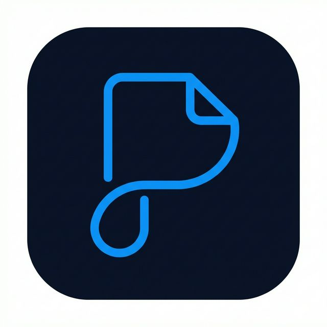

[](http://www.gnu.org/licenses/gpl-3.0)

<div align="center">
  <span align="center"> </span>
  <h1 align="center">Planote</h1>
  <h3 align="center">Your thoughts, beautifully organized</h3>
</div>

## About

Planote is a beautiful and powerful note-taking application, forked from [Planify](https://github.com/alainm23/planify) by Alain M. It combines powerful task management with a focused, distraction-free note-taking experience.

## ✨ Features

### 🎯 Core Functionality

- **🚀 Modern Interface**: Clean, intuitive design built with GTK4 and libadwaita
- **📝 Focused Note Editor**: A distraction-free environment for your thoughts, supporting structured Headings (H1-H6) for organization.
- **🤚 Drag & Drop**: Effortlessly organize notes, tasks, and projects
- **💯 Progress Tracking**: Visual indicators show completion status at a glance
- **📂 Smart Organization**: Group items into sections with custom labels
- **📅 Calendar Integration**: Visualize your schedule and plan effectively
- **⏰ Flexible Reminders**: Multiple reminders per task
- **🌙 Dark Mode**: Seamless integration with system themes
- **🔍 Quick Search**: Find anything instantly

### ☁️ Cloud Synchronization

- **Todoist Integration**: Full sync with your existing Todoist account
- **Nextcloud Support**: Keep your data private with self-hosted solutions
- **Offline Mode**: Work without internet - sync when you're back online

_Note: Planote is not created by, affiliated with, or supported by Doist_

## 📚 Documentation

Detailed documentation is available in the `docs/` directory:

-   **[User Guide](docs/user_guide.md)**: How to use Planote, including the new simplified editor.
-   **[Development Guide](docs/development.md)**: Build instructions, project structure, and IDE setup.
-   **[Testing Guide](docs/testing.md)**: Running tests and debugging.
-   **[Deployment Guide](docs/deployment.md)**: Packaging and release process.

## 📰 Changelog & Releases

-   Check **[CHANGELOG.md](CHANGELOG.md)** for a history of changes.
-   See specific **[RELEASE_NOTES.md](RELEASE_NOTES.md)** for release highlights.

## 📥 Installation

For detailed build instructions, please refer to the **[Development Guide](docs/development.md)**.

### Quick Build

```bash
meson build --prefix=/usr
cd build
ninja
sudo ninja install
io.github.dev_aatif.planote
```

## 🤝 Contributing

Contributions are welcome! Please feel free to submit issues and pull requests. See the **[Development Guide](docs/development.md)** for more info.

## 📋 Credits

Planote is a fork of [Planify](https://github.com/alainm23/planify) by Alain M. (alainm23).
We thank Alain and all Planify contributors for their excellent work.

## 📄 License

This project is licensed under the GNU General Public License v3.0 - see the [LICENSE](LICENSE) file for details.

<div align="center">
  <strong>Made with 💜</strong>
</div>
